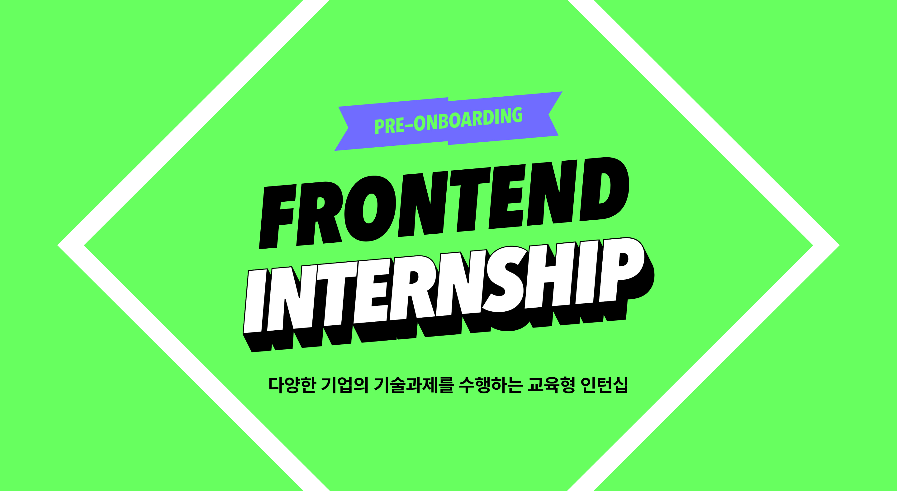

# 🚀 원티드 Pre-Onboarding 인턴십 선발 과제

   
  
   

## 🐮🐶 프로젝트 소개

JavaScript와 React를 사용하여 회원가입 / 로그인 / Todo 리스트 페이지 및 기능 구현

 

## 🔨 기술 스택

<table>
  <tr>
    <th style="width:25%">JavaScript</th>
    <th style="width:25%">TypeScript</th>
    <th style="width:25%">Styled-Components</th>
    <th style="width:25%">React</th>
  </tr>
  <tr>
    <td></td>
    <td></td>
    <td></td>
    <td></td>
  </tr>
</table>

 

## 💿 구현 기능

### 💾 회원가입 페이지 내 기능

- 회원가입 페이지 진입 시 localStorage 내 token 값을 확인해 유효한 JWT 토큰을 발급받은 이력이 있다면 Todo 리스트 페이지로 이동.
- 정규식을 통해 회원가입 정보를 입력 받을 시 유효성 검사 진행.
- 라벨을 활용해 필수조건 및 조건 충족 여부 텍스트로 출력.
- 조건을 모두 충족 시 '가입하기' 버튼 활성화.
- 아이디 중복 시 alert 출력.
- 회원가입 완료 시 로그인 페이지로 이동.

### 💾 로그인 페이지 내 기능

- 로그인 페이지 진입 시 localStorage 내 token 값을 확인해 유효한 JWT 토큰을 발급받은 이력이 있다면 todo 페이지로 이동.
- 정규식을 통해 로그인 정보를 입력 받을 시 유효성 검사 진행.
- 라벨을 활용해 조건 충족 여부 텍스트로 출력.
- 조건을 모두 충족 시 '로그인' 버튼 활성화.
- DB에 입력한 정보가 없을 시 alert 출력.
- 로그인 완료 시 발급 받은 JWT 토큰을 localStage에 저장.
- 로그인 완료 시 Todo 리스트 페이지로 이동.

### 💾 Todo 리스트 페이지 내 기능

- Todo 리스트 페이지 진입 시 localStorage에 저장된 유효한 토큰이 없다면 로그인 페이지로 이동.
- 로그아웃 버튼을 통해 로그아웃 가능. (회원가입 및 로그인 페이지 접속 가능)

##### 📓 Todo 추가 기능 (Create)

- input에 내용을 입력 받고 추가 버튼 클릭 또는 엔터키 이벤트를 통해 Todo create, input이 비어있을 경우 '추가' 버튼 비활성화.
- 수정 버튼 클릭 시 Todo의 텍스트 -> Input으로 변경되면서 포커싱.
- 수정 도중 취소 버튼을 누르면 기존 내용으로 돌아감.

##### 📓 Todo 리스트 출력 기능 (Read)

- 렌더링이 될때 해당 아이디로 추가한 Todo들을 서버로부터 read 후 브라우저에 출력.

##### 📓 Todo 수정 기능 (Update)

- 수정 버튼 클릭 이벤트 시 Todo의 내용이 input으로 변경 후 포커싱.
- input이 비어있을 경우 '제출' 버튼 비활성화
- 내용 수정 후 제출 버튼 클릭 또는 엔터키 이벤트로 내용 update.
- 취소 버튼 클릭 이벤트 시 기존 내용으로 revert.

##### 📓 Todo 삭제 기능 (Delete)

- 삭제 버튼 클릭 이벤트 시 해당 Todo를 삭제.

 

## 🥬 프로젝트 배포 링크

<a href="http://gmgmgun-wanted.shop/signup"> 회원가입 페이지 </a>
<a href="http://gmgmgun-wanted.shop/signin"> 로그인 페이지 </a>
<a href="http://gmgmgun-wanted.shop/todo"> Todo 리스트 페이지 </a>

- 미로그인 시 Todo 리스트 페이지에 접속하면 자동으로 sigin 페이지로 이동하니 회원가입 및 로그인 후 접속해주세요!
   
- 로그인 이후 회원가입 페이지 또는 로그인 페이지로 접속 시 자동으로 Todo 리스트 페이지로 이동하니 다시 회원가입 또는 로그인을 원하시면 Todo 리스트 페이지 내 로그아웃 버튼을 클릭해주세요!

<!-- Stack Icon Refernces -->

[js]: /images/javascript-color.svg
[ts]: /images/typescript-color.svg
[sc]: /images/styledcomponents-color.svg
[react]: /images/react-color.svg
